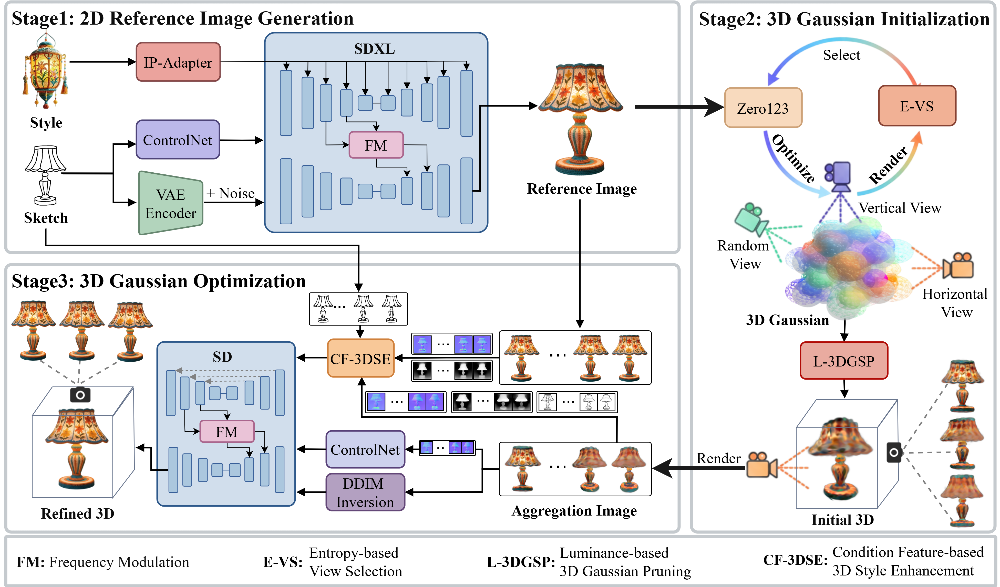

# SketchDreamer: Image Guided Sketch-driven 3D Generation with Dual-domain Style Enhancement ####

 

*[Dongdong Jing](https://orcid.org/0009-0008-8547-7778), [Xingtao Wang](https://homepage.hit.edu.cn/xtwang),
[Hengyu Man](https://homepage.hit.edu.cn/manhengyu?lang=zh), [Yanfeng Gu](https://homepage.hit.edu.cn/guyf?lang=zh), and [Xiaopeng Fan](https://homepage.hit.edu.cn/xiaopengfan?lang=zh)*

> The pipeline of SketchDreamer, which is divided into three stages. In the first stage, the 2D reference image generation module  is used to generate a high-quality stylized reference image with structural fidelity and consistent style. In the second stage, the 3D Gaussian initialization module  is used to convert a stylized reference image into an initial 3D Gaussian model with basic geometric structure. In the third stage, the quality of 3D Gaussians is improved using the 3D Gaussian optimization module .

## 📚Paper 
#### SketchDreamer: Image Guided Sketch-driven 3D Generation with Dual-domain Style Enhancement ####
## ⭐Code
The source code will be publicly released after paper accepted.
## 📦Dataset
Our experiments utilize a public dataset: [ShapeNet-Sketch3D](https://huggingface.co/datasets/zwgd/sketch3D/tree/main)

